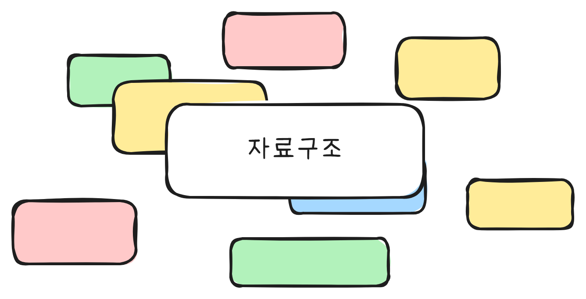
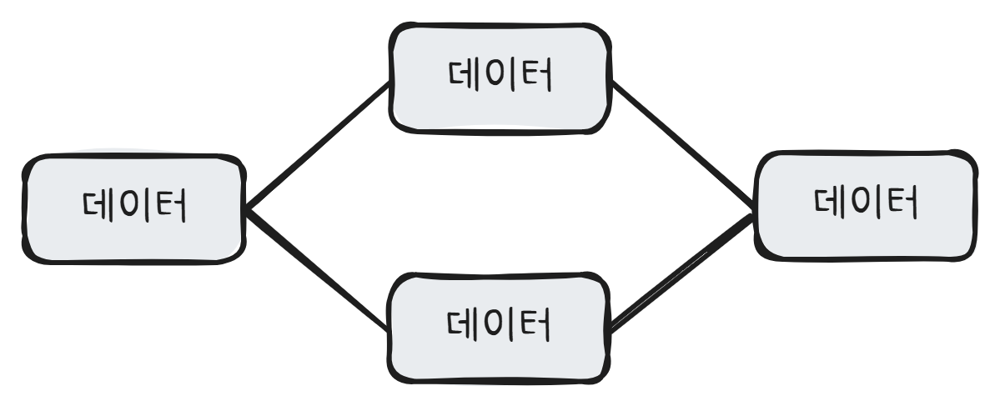

## 자료구조 정리

 

&nbsp;우리는 프로그래밍을 하면서 필요한 데이터를 int, float, String 등 다양한 형태의 변수로 저장한다. 그러나 데이터의 양이 많아질수록 이를 적절하게 관리할 방법이 필요하다. **자료구조(Data Structure)**는 이런 주제를 다룬다.
  &nbsp;자료구조란 '컴퓨터에 자료를 효율적으로 저장하는 방식'을 말한다. 다시 설명하자면, 자료구조는 **데이터를 사용할 의도에 맞춰 적절하게 구조화하는 것**을 의미한다.
  &nbsp;예를 들어 한 학급의 학생들을 1번부터 30번까지 번호를 매겨 데이터로 저장한다고 해 보자. 우리는 이 데이터를 가지고 전체 학생 리스트를 출력하거나, 또는 특정 번호의 학생 이름을 출력하는 의도로 사용할 수 있다. 그렇다면 각각의 학생들의 번호와 이름을 별도의 변수로 저장하는 것보다는, 자료구조 중 하나인 '리스트'로 저장하는 게 효율적일 수 있다. 리스트를 사용하면 각 학생의 정보가 순서를 가지고 연결이 되며(그냥 변수를 만들어 저장한다면, 순서 같은 건 없을 것이다), 중간에 새로운 학생의 정보를 넣거나 기존의 학생 정보를 지우는 것도 간단해진다. 리스트에서는 그런 기능을 구현해둘 수 있기 때문이다.
  &nbsp;자료구조를 사용하는 것은 다양한 장점을 가진다. 프로그래머가 자료를 다루기 더 쉬워질 뿐만 아니라, 알고리즘을 적용할 수 있기 때문에 프로그램의 성능 자체도 향상된다. 반대로 자료구조를 사용하지 않는다면 알고리즘도 사용할 수 없고 (대부분의 알고리즘은 특정 자료구조 위에서 동작한다) 코드도 매우 복잡해지며 데이터를 유연하게 다룰 수도 없게 될 것이다.

---

### 자료구조의 종류

&nbsp;자료구조는 크게 '선형 자료구조'와 '비선형 자료구조'로 나뉜다.
  &nbsp;**선형 자료구조**는 데이터를 선형으로 연결하는 것으로, 대표적으로 **리스트, 스택, 큐**가 있다.
  &nbsp;**비선형 자료구조**는 데이터를 비선형으로 연결하는 것으로, 대표적으로 **트리, 그래프**가 있다.

---

#### 배열 리스트 (Array List)

    
파이썬 코드

    '''python
    print('Hello Python!')
    '''

---

#### 연결 리스트 (Linked List)

---

#### 스택 (Stack)

---

#### 큐 (Queue)

---

#### 디큐 (Dequeue)

---

#### 트리 (Tree)

---

#### 힙 (Heap)

---

#### 그래프 (Graph)

---

#### 해시 테이블 (Hash Table)
