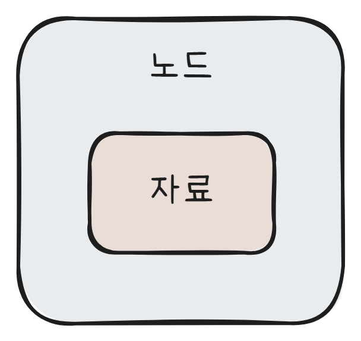

## 자료구조 정리

 

&nbsp;우리는 프로그래밍을 하면서 필요한 데이터를 int, float, String 등 다양한 형태의 변수로 저장한다. 그러나 데이터의 양이 많아질수록 이를 적절하게 관리할 방법이 필요하다. **자료구조(Data Structure)**는 이런 주제를 다룬다.
<br><br>&nbsp;자료구조란 '컴퓨터에 자료를 효율적으로 저장하는 방식'을 말한다. 다시 설명하자면, 자료구조는 **데이터를 사용할 의도에 맞춰 적절하게 구조화하는 것**을 의미한다.
<br><br>&nbsp;예를 들어 한 학급의 학생들을 1번부터 30번까지 번호를 매겨 데이터로 저장한다고 해 보자. 우리는 이 데이터를 가지고 전체 학생 리스트를 출력하거나, 또는 특정 번호의 학생 이름을 출력하는 의도로 사용할 수 있다. 그렇다면 각각의 학생들의 번호와 이름을 별도의 변수로 저장하는 것보다는, 자료구조 중 하나인 '리스트'로 저장하는 게 효율적일 수 있다. 리스트를 사용하면 각 학생의 정보가 순서를 가지고 연결이 되며(그냥 변수를 만들어 저장한다면, 순서 같은 건 없을 것이다), 중간에 새로운 학생의 정보를 넣거나 기존의 학생 정보를 지우는 것도 간단해진다. 리스트에서는 그런 기능을 구현해둘 수 있기 때문이다.
<br><br>&nbsp;자료구조를 사용하는 것은 다양한 장점을 가진다. 프로그래머가 자료를 다루기 더 쉬워질 뿐만 아니라, 알고리즘을 적용할 수 있기 때문에 프로그램의 성능 자체도 향상된다. 반대로 자료구조를 사용하지 않는다면 알고리즘도 사용할 수 없고 (대부분의 알고리즘은 특정 자료구조 위에서 동작한다) 코드도 매우 복잡해지며 데이터를 유연하게 다룰 수도 없게 될 것이다.


---


### 자료구조의 종류

&nbsp;자료구조는 크게 '선형 자료구조'와 '비선형 자료구조'로 나뉜다.
<br><br>&nbsp;


**선형 자료구조**는 데이터를 선형으로 연결하는 것으로, 대표적으로 **리스트, 스택, 큐**가 있다.

선형 자료구조는 **리스트가 가장 기본**이 되며, 스택과 큐는 여기에 몇 가지 특징을 추가한 것이다. 자료들 사이의 앞뒤 관계가 일대일이다.

<br><br>


&nbsp;**비선형 자료구조**는 데이터를 비선형으로 연결하는 것으로, 대표적으로 **트리, 힙, 그래프**가 있다.

비선형 자료구조는 자료들 사이의 앞뒤 관계가 일대일이 아니다. 이를 보통 다대다 관계라고 부른다.


<hr>

### 미리 알아야 할 개념

##### 1. 시간 복잡도

&nbsp;위에서 말했듯 자료구조는 알고리즘과 관계가 깊다. 알고리즘은 프로그램의 성능을 높이기 위하여 코드를 더욱 효율적으로 작성하기 위한 것인데, 이런 알고리즘이 특정한 자료구조 위에서 동작하기 때문이다.

&nbsp;알고리즘의 성능은 **연산 횟수가 얼마나 적느냐**로 결정된다. 이와 관련하여 나오는 개념이 바로 **시간 복잡도**인데, 알고리즘의 수행에 걸리는 시간을 나타내 주는 지표이다.

&nbsp;예를 들어 C언어로 작성된 아래의 코드를 보자.

```c
int algorithm(int n) {
    int i = 0;					// 1번
    int sum = 0;				// 1번

    for (; i < n; i++) {		// n * 2번
        sum += i;				// n * 1번
    }
    
    return sum;
}
```

&nbsp;위의 함수는 입력받은 파라미터 n의 값에 따라서 내부에서 반복문을 실행한다. 그렇다면 총 몇 번의 연산이 실행될까?

&nbsp;우선 `int i = 0;`에서 1번, `int sum = 0;`에서 1번의 연산이 실행된다. 그 다음 **for문은 총 n번 반복**되는데, 각 반복마다 `i < n`, `i++`, `sum += i` 가 각각 실행되므로 for문에서는 총 **3n**번의 연산을 한다고 볼 수 있다.

&nbsp;따라서 위의 함수에서 내부적으로는 총 **3n + 2**번의 연산이 발생한다고 볼 수 있다. 이것을 **시간 복잡도 함수**라고 부른다. 위의 함수는 넣는 값 n에 따라 3n + 2번의 연산이 발생하므로 시간 복잡도 함수가 3n + 2이다.

<br>

&nbsp;여기에서 가장 높은 차수를 가진 항만을 표기하는 방법을 **빅-오 표기법**이라고 한다. 예를 들어 위의 함수는 시간 복잡도 함수가 3n + 2이므로 최고차항은 3n이고, 계수를 생략하면 n이 된다. 따라서 위의 함수를 빅-오 표기법으로 나타내면 **O(n)**이 된다.

<br>

##### 2. 노드

&nbsp;자료구조를 다루려면 먼저 **노드**에 대해서 알아야 한다. 노드란 자료를 저장하는 단위를 말한다.



&nbsp;위와 같은 구조로 되어있는 것이 하나의 노드이고, 자료구조가 바로 이런 **노드 각각이 다른 노드들과 연결되어 구조를 형성하는 것**으로 구현된다. 노드는 일반적으로 **클래스**를 통해 구현되지만, C언어의 경우 클래스의 개념이 없기 때문에 **구조체**로 구현한다.

&nbsp;왜 자료를 그대로 사용하지 않고 노드를 사용하는 것일까? 그것은 노드 안에 여러 개의 자료를 담을 수 있기 때문이다. 예를 들어 아래의 코드를 보자.

```c
int students[10];
```

&nbsp;이와 같은 식으로 배열을 만들면 students[] 각각에 하나의 int값만 담을 수 있다. 두 개 이상의 값을 하나의 자료에 넣는 것이 불가능하다.

```c
typedef struct NodeType {
    int number;
    int age;
} Node;
```

&nbsp;하지만 이런 식으로 **Node 구조체**를 만들면 어떨까? struct NodeType으로 구조체가 만들어졌고, 이 구조체 안에는 number와 age의 두 개의 변수가 있다. 그리고 typedef를 통해서 struct NodeType을 Node라는 이름을 통해 쓸 수 있도록 만들었다.

```c
Node students[10];
```

&nbsp;결과적으로 이런 코드를 사용할 수 있게 되는 것이다. 위에서 본 `int students[10];`와 달리 `Node students[10];`는 각각의 자료가 노드이기 때문에 두 개의 값(number, age)을 저장할 수 있다. 각각의 노드에 값을 몇 개 저장할지는 Node를 어떻게 만드느냐에 달려 있다.

<br>


---

#### 배열 리스트 (Array List)


---

#### 연결 리스트 (Linked List)


---

#### 스택 (Stack)


---

#### 큐 (Queue)


---

#### 디큐 (Dequeue)


---

#### 트리 (Tree)


---

#### 힙 (Heap)


---

#### 그래프 (Graph)


---

#### 해시 테이블 (Hash Table)
